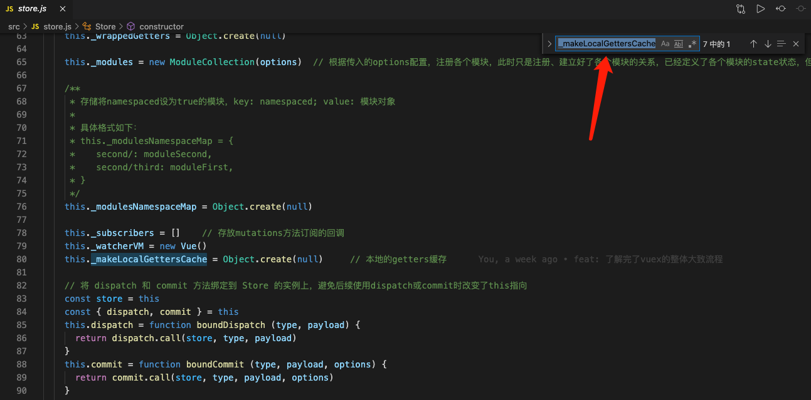
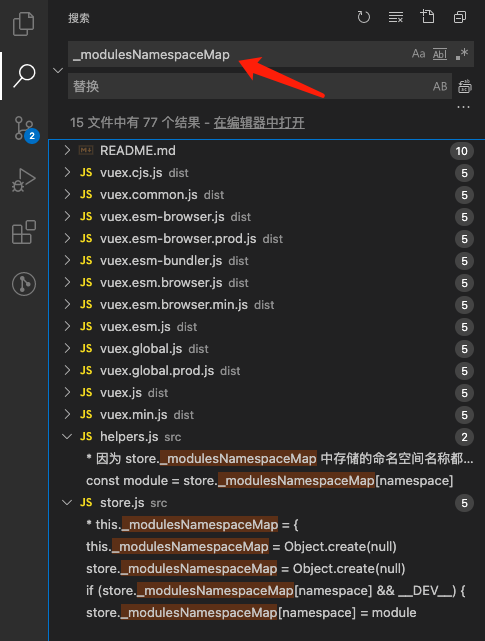

# 📢 说明

本仓库用于阅读并记录 `Vuex` 源码，**注：** 所有对于源码的解读都在相应文件（`./src`）中加上了中文注释

>若你觉得本仓库对你非常有帮助，欢迎点个 **star** 支持我一下哦～

非常建议一些能力有限并且从未阅读过成熟库源码的前端把 **Vuex源码** 作为自己第一个阅读源码的库，因为它本身代码量只有几百行，实现逻辑也非常易懂，我相信只要用心、肯花费时间，一定能将它的源码读懂的

当然，阅读源码的前提是你必须对这个库有一定的使用经验以及了解，否则就算开始阅读源码了，你也很难知道它在做什么  ➡️   [Vuex官方文档](https://vuex.vuejs.org/zh/)

刚开始做好阅读源码的准备，我给自己定下的期限是 `15`天，最终算上编写此文档的时间，一共用了 `8` 天

`Vuex`也是我第一次阅读源码的库，本仓库会记录下我阅读源码的全过程以及经验分享，希望可以帮助到大家～

# ☀️ 进度（8/8）

**【2021年】** 每天阅读或总结整理2小时（时间线中若未出现的日期，可能是因为其它事情耽搁了）

> **Start**   1月15日 ：熟悉了 `Modules` 的注册流程

>1月16日：了解了一下每个 `module` 注册 `state` 、`mutations` 、`actions`、`getters` 的大体流程

>1月17日：详细了解了 `vm` 对 `state` 、`getters` 的处理方式

>1月19日：大致了解完了全部的流程，但还有很多细节没明白，并攥写了部分源码的阅读文档

>1月20日：捋清了很多细节部分，同时更新了部分源码的阅读文档

>1月23日：编写了部分源码的阅读文档

> 1月25日：编写了绝大部分源码的阅读文档

> **End** 1月26日：了解了 `Vuex` 的 `install` 方法、辅助函数，并更新了全部的源码阅读文档

# 🔥 源码解析

## 一、源码目录结构分析
整个 `Vuex` 的源码文件非常多，我们直接看最主要的文件，即 `src` 文件夹中的内容，结构示例如下：

```js
├── src
    ├── module    // 与模块相关的操作
    │   ├── module-collection.js   // 用于收集并注册根模块以及嵌套模块
    │   └── module.js   // 定义Module类，存储模块内的一些信息，例如: state...
    │
    ├── plugins   // 一些插件
    │   ├── devtool.js   // 开发调试插件
    │   └── logger.js    // 
    │
    ├── helpers.js       // 辅助函数，例如：mapState、mapGetters、mapMutations...
    ├── index.cjs.js     // commonjs 打包入口
    ├── index.js         // 入口文件
    ├── index.mjs        // es6 module 打包入口
    ├── mixin.js         // 将vuex实例挂载到全局Vue的$store上
    ├── store.js         // 核心文件，定义了Store类
    └── util.js          // 提供一些工具函数，例如: deepCopy、isPromise、isObject...
```


## 二、源码阅读

### 1. 查看工具函数

首先我个人觉得肯定是要看一下 `util.js` ，这里面存放的是源码中频繁用到的工具函数，所以我觉得要最先了解一下每个函数的作用是什么

```js
/**
 * Get the first item that pass the test
 * by second argument function
 *
 * @param {Array} list
 * @param {Function} f
 * @return {*}
 */

// 找到数组list中第一个符合要求的元素
export function find (list, f) {
  return list.filter(f)[0]
}

/**
 * 深拷贝
 * 
 * @param {*} obj
 * @param {Array<Object>} cache
 * @return {*}
 */
export function deepCopy (obj, cache = []) {
  // just return if obj is immutable value
  if (obj === null || typeof obj !== 'object') {
    return obj
  }

  // if obj is hit, it is in circular structure
  const hit = find(cache, c => c.original === obj)
  if (hit) {
    return hit.copy
  }

  const copy = Array.isArray(obj) ? [] : {}
  // put the copy into cache at first
  // because we want to refer it in recursive deepCopy
  cache.push({
    original: obj,
    copy
  })

  Object.keys(obj).forEach(key => {
    copy[key] = deepCopy(obj[key], cache)
  })

  return copy
}

// 遍历obj对象的每个属性的值
export function forEachValue (obj, fn) {
  Object.keys(obj).forEach(key => fn(obj[key], key))
}

// 判断是否为对象（排除null）
export function isObject (obj) {
  return obj !== null && typeof obj === 'object'
}

// 判断是否为Promise对象
export function isPromise (val) {
  return val && typeof val.then === 'function'
}

// 断言
export function assert (condition, msg) {
  if (!condition) throw new Error(`[vuex] ${msg}`)
}

// 保留原始参数的闭包函数
export function partial (fn, arg) {
  return function () {
    return fn(arg)
  }
}
```

每个函数的作用我都写上了注释，稍微阅读一下应该可以明白其作用

### 2. 入口文件

最主要的代码都在 `src` 目录下，所以以下提到的文件都是默认 `src` 目录下的文件

首先，肯定从入口文件 `index.js` 开始看，但能发现的是，还有 `index.cjs` 和 `index.mjs` ，这两者分别是 `commonjs` 和 `es6 module` 的打包入口，我们就不用管了

```js
import { Store, install } from './store'
import { mapState, mapMutations, mapGetters, mapActions, createNamespacedHelpers } from './helpers'
import createLogger from './plugins/logger'

export default {
  Store,
  install,
  version: '__VERSION__',
  mapState,
  mapMutations,
  mapGetters,
  mapActions,
  createNamespacedHelpers,
  createLogger
}

export {
  Store,
  install,
  mapState,
  mapMutations,
  mapGetters,
  mapActions,
  createNamespacedHelpers,
  createLogger
}
```

从入口文件中可以看到，主要导出了 `Store` 类 、`install` 方法以及一些辅助函数（mapState、mapMutations、mapGetters...）

那么我们主要看的就是 `vuex` 的核心代码，即 `store.js` ，可以看到 `Store` 类就出自于这个文件

### 3. Store类的实现

整个 `Store` 类的主要逻辑都在它的构造函数 `constructor` 中，因此我们就从 `constructor` 中分步去捋逻辑、看代码

#### 3.1 存放类的状态

首先是定义了一些实例状态，用于存放模块、`mutations` 、`actions` 、`getters` 缓存等东西

```js
const {
  plugins = [],
  strict = false
} = options      // 生成Store类的入参

this._committing = false        // 表示提交的状态，当通过mutations方法改变state时，该状态为true，state值改变完后，该状态变为false; 在严格模式下会监听state值的改变，当改变时，_committing为false时，会发出警告，即表明state值的改变不是经过mutations的

this._actions = Object.create(null)  // 用于记录所有存在的actions方法名称（包括全局的和命名空间内的，且允许重复定义）      

this._actionSubscribers = []       // 存放actions方法订阅的回调函数

this._mutations = Object.create(null)  // 用于记录所有存在的的mutations方法名称（包括全局的和命名空间内的，且允许重复定义）

this._wrappedGetters = Object.create(null)  // 收集所有模块包装后的的getters（包括全局的和命名空间内的，但不允许重复定义）

this._modules = new ModuleCollection(options)  // 根据传入的options配置，注册各个模块，此时只是注册、建立好了各个模块的关系，已经定义了各个模块的state状态，但getters、mutations等方法暂未注册

this._modulesNamespaceMap = Object.create(null)   // 存储定义了命名空间的模块

this._subscribers = []    // 存放mutations方法订阅的回调

this._watcherVM = new Vue()  // 用于监听state、getters

this._makeLocalGettersCache = Object.create(null)   // getters的本地缓存
```

关于各个变量状态的作用都写在这了，其中只有 `this._modules = new ModuleCollection(option)` 执行了一些操作，其作用就是进行**模块递归收集**，根据 `ModuleCollection` 的来源，我们移步到 `./module/module-collection.js` 文件

##### 3.1.1 递归收集模块

在 `Module-collection.js` 文件中定义了 `ModuleCollection` 类，其作用就是通过递归遍历 `options` 入参，将每个模块都生成一个独立的 `Moudle`

这里先来熟悉一下 `options` 的结构，如下：

```js
import Vuex from 'vuex'

const options = {
  state: {...},
  getters: {...},
  mutations: {...},
  actions: {...},
  modules: {
    ModuleA: {
      state: {...},
      ...
      modules: {
        ModuleA1: {...}
      }
    },
    ModuleB: {
      state: {...},
      ...
      modules: {
        ModuleB1: {...}
      }
    }
  }
}

const store = new Vuex.Store(options)

export default store
```

可以看到传入的 `options` 整体可以看成一个根模块 `root` ，然后 `root` 的 `modules` 中嵌套着另外两个子模块：`ModuleA` 和`ModuleB` ，而 `ModuleA` 和`ModuleB` 内部也分别嵌套着一个子模块，分别为 `ModuleA1` 、`ModuleB1` 。这样就组成了一个模块树，因此 `ModuleCollection` 类的工作就是将保留原来的模块关系，将每个模块封装到一个 `Module` 类中

```js
export default class ModuleCollection {
  constructor (rawRootModule) {
    // 递归注册模块
    this.register([], rawRootModule, false)
  }
  
  // 根据路径顺序，从根模块开始递归获取到我们准备添加新的模块的父模块
  get (path) {
    return path.reduce((module, key) => {
      return module.getChild(key)
    }, this.root)
  }
  
  // 递归注册模块
  register (path, rawModule, runtime = true) {
    if (__DEV__) {
      assertRawModule(path, rawModule)
    }
    
    const newModule = new Module(rawModule, runtime)  // 初始化一个新的模块
    if (path.length === 0) {    // 当前没有别的模块
      this.root = newModule     // 则此模块为根模块
    } else {    // 有多个模块     
      const parent = this.get(path.slice(0, -1))   // 获取到新模块从属的父模块，所以是path.slice(0, -1)，最后一个元素就是我们要添加的子模块的名称
      parent.addChild(path[path.length - 1], newModule)    // 在父模块中添加新的子模块
    }

    if (rawModule.modules) {     // 如果有嵌套模块
      /**
       *  1. 遍历所有的子模块，并进行注册;
       *  2. 在path中存储除了根模块以外所有子模块的名称
       *  */ 
      forEachValue(rawModule.modules, (rawChildModule, key) => {
        this.register(path.concat(key), rawChildModule, runtime)
      })
    }
  }
}
```

**函数作用：**

1. `register(path, rawModule, runtime)`：注册新的模块，并根据模块的嵌套关系，将新模块添加作为对应模块的子模块

- path：表示模块嵌套关系。当前为根模块时，没有任何嵌套关系，此时 `path = []` ; 当前不是根模块时，存在嵌套关系，例如上述例子中的 `ModuleA1` ，它是 `ModuleA` 的子模块 ，而 `ModuleA` 又是根模块的子模块，此时 `path = ['ModuleA', 'ModuleA1']`
- rawModule：表示模块对象，此时是一个对象类型
- runtime：表示程序运行时


2. `get(path)`：根据传入的 `path` 路径，获取到我们想要的 `Module` 类

   

`ModuleCollection` 的构造函数中调用了 `register` 函数，前两个参数分别为：`[]` 、`rawRootModule` ，此时肯定是从根模块开始注册的，所以 `path` 里无内容，并且 `rawRootModule` 指向的是根模块


然后来看一下 `register` 函数里的逻辑。

1. 首先将当前要注册的模块生成一个 `Module` ，并将 `rawModule` 作为参数，用于存放 `Module` 的信息

2. 然后通过 `if(path.length === 0)` 判断是否为根模块，是的话就将 `this.root` 指向 `Module` ; 否则就跳到第3步
3. 判断当前模块不是根模块，就通过 `get` 函数找到当前模块的父模块，然后调用父模块中的 `addChild` 方法将当前模块添加到子模块中
4. 最后再判断当前模块是否还有嵌套的模块，有的话就重新回到第1步进行递归操作 ; 否则不做任何处理


按照上面的逻辑，就可以将所有的模块递归收集并注册好了，其中有一个 `Module` 类还没有具体提到，所以这里移步到 `./module/module.js` 

```js
import { forEachValue } from '../util'

// 定义了Vuex中的 Module 类，包含了state、mutations、getters、actions、modules
export default class Module {
  constructor (rawModule, runtime) {
    this.runtime = runtime
    
    this._children = Object.create(null)   // 创建一个空对象，用于存放当前模块的子模块
    
    this._rawModule = rawModule         // 当前模块的一些信息，例如：state、mutations、getters、actions、modules
    const rawState = rawModule.state    // 1. 函数类型 => 返回一个obj对象; 2. 直接获取到obj对象

    // 存储当前模块的state状态
    this.state = (typeof rawState === 'function' ? rawState() : rawState) || {}   
  }

  // 判断该模块是否定义了namespaced，定义了则返回true; 否则返回false
  get namespaced () {
    return !!this._rawModule.namespaced
  }

  // 添加子模块，名称为key
  addChild (key, module) {
    this._children[key] = module
  }

  // 移除名称为key的子模块
  removeChild (key) {
    delete this._children[key]
  }

  // 获取名称为key的子模块
  getChild (key) {
    return this._children[key]
  }

  // 是否存在名称为key的子模块
  hasChild (key) {
    return key in this._children
  }
	
  // 将当前模块的命名空间更新到指定模块的命名空间中，并同时更新一下actions、mutations、getters的调用来源
  update (rawModule) {
    this._rawModule.namespaced = rawModule.namespaced
    if (rawModule.actions) {
      this._rawModule.actions = rawModule.actions
    }
    if (rawModule.mutations) {
      this._rawModule.mutations = rawModule.mutations
    }
    if (rawModule.getters) {
      this._rawModule.getters = rawModule.getters
    }
  }

  // 遍历当前模块的所有子模块，并执行回调操作
  forEachChild (fn) {
    forEachValue(this._children, fn)
  }

  // 遍历当前模块的所有getters，并执行回调操作
  forEachGetter (fn) {
    if (this._rawModule.getters) {
      forEachValue(this._rawModule.getters, fn)
    }
  }

  // 遍历当前模块的所有actions，并执行回调操作
  forEachAction (fn) {
    if (this._rawModule.actions) {
      forEachValue(this._rawModule.actions, fn)
    }
  }

  // 遍历当前模块的所有mutations，并执行回调操作
  forEachMutation (fn) {
    if (this._rawModule.mutations) {
      forEachValue(this._rawModule.mutations, fn)
    }
  }
}
```

来看一下刚才模块收集时，创建的 `Module` 类内部做了什么事情，同样的从 `constructor` 中开始看

`this._children` 是一个对象值，用于存放该模块嵌套的其它 `Module` 类 ;

`this._rawModule` 就是用于存放该模块内部的一些信息，例如：`state` 、`mutations` 、`actions` 、`getters` 、`moudles` ;

`this.state` 对应的就是 `this._rawModule` 中的 `state` ;

 这是整个构造函数中执行的操作，我们可以看到，在生成一个 `Module` 类的时候，其只定义了 `state` 属性，而 `mutations` 、`getters` 、`actions` 、`modules` 都是没有被定义的，即例如现在是无法通过 `Module.mutations` 获取到该模块所有的 `mutations` 方法，那么这些方法都是在何时被定义的呢？自然是等模块全部都收集完毕以后才进行的操作，因为 `vuex` 中的嵌套模块可能会存在命名空间 `namespaced` 

#### 3.2 注册模块

到此为止，各个模块的类都创建好了，那么继续回到 `./src/store.js` 的 `constructor` 构造函数中

```js
// 将 dispatch 和 commit 方法绑定到 Store 的实例上，避免后续使用dispatch或commit时改变了this指向
const store = this
const { dispatch, commit } = this
this.dispatch = function boundDispatch (type, payload) {
  return dispatch.call(store, type, payload)
}
this.commit = function boundCommit (type, payload, options) {
  return commit.call(store, type, payload, options)
}

// 判断store是否未严格模式。true: 所有的state都必须经过mutations来改变
this.strict = strict

// 将根模块的state赋值给state变量
const state = this._modules.root.state
```

这段代码首先对 `Store` 实例上的 `dispatch` 和 `commit` 方法进行了一层包装，即通过 `call` 将这两个方法的作用对象指向当前的 `Store` 实例，这样就能防止后续我们操作时，出现 `this.$store.dispatch.call(obj, 1)` 类似的情况而报错

 `this.strict` 是用于判断是否是严格模式。因为 `vuex` 中，建议所有的 `state` 变量的变化都必须经过 `mutations` 方法，因为这样才能被 `devtool` 所记录下来，所以在严格模式下，未经过 `mutations` 而直接改变了 `state` 的值，开发环境下会发出警告⚠️

`const state = this._modules.root.state`  获取的是根模块的 `state` ，用于后续的一些操作

一切都准备就绪了，下面就开始为每个模块注册信息了

```js
// 从根模块开始，递归完善各个模块的信息
installModule(this, state, [], this._modules.root)
```

调用了 `installModule` 方法，并将 `store` 实例对象 、`state` 属性 、路径 、根模块对象依次作为参数进行传递

```js
// 注册完善各个模块内的信息
function installModule (store, rootState, path, module, hot) {
  const isRoot = !path.length  // 是否为根模块
  const namespace = store._modules.getNamespace(path)  // 获取当前模块的命名空间，格式为：second/ 或 second/third/

  // 如果当前模块设置了namespaced 或 继承了父模块的namespaced，则在modulesNamespaceMap中存储一下当前模块
  if (module.namespaced) {
    if (store._modulesNamespaceMap[namespace] && __DEV__) {
      console.error(`[vuex] duplicate namespace ${namespace} for the namespaced module ${path.join('/')}`)
    }
    store._modulesNamespaceMap[namespace] = module
  }

  // 如果不是根模块，将当前模块的state注册到其父模块的state上
  if (!isRoot && !hot) {
    const parentState = getNestedState(rootState, path.slice(0, -1)) // 获取父模块的state
    const moduleName = path[path.length - 1]   // 当前模块的名称
    store._withCommit(() => {
      if (__DEV__) {
        if (moduleName in parentState) {
          console.warn(
            `[vuex] state field "${moduleName}" was overridden by a module with the same name at "${path.join('.')}"`
          )
        }
      }
      // 将当前模块的state注册在父模块的state上，并且是响应式的
      Vue.set(parentState, moduleName, module.state)
    })
  }

  // 设置当前模块的上下文context
  const local = module.context = makeLocalContext(store, namespace, path)

  // 注册模块的所有mutations
  module.forEachMutation((mutation, key) => {
    const namespacedType = namespace + key     // 例如：first/second/mutations1
    registerMutation(store, namespacedType, mutation, local)
  })

  // 注册模块的所有actions
  module.forEachAction((action, key) => {
    /**
     * actions有两种写法：
     * 
     * actions: {
     *    AsyncAdd (context, payload) {...},   // 第一种写法
     *    AsyncDelete: {                       // 第二种写法
     *      root: true,
     *      handler: (context, payload) {...}
     *    } 
     * }
     */
    const type = action.root ? key : namespace + key   // 判断是否需要在命名空间里注册一个全局的action
    const handler = action.handler || action          // 获取actions对应的函数
    registerAction(store, type, handler, local)   
  })

  // 注册模块的所有getters
  module.forEachGetter((getter, key) => {
    const namespacedType = namespace + key
    registerGetter(store, namespacedType, getter, local)
  })

  // 递归注册子模块
  module.forEachChild((child, key) => {
    installModule(store, rootState, path.concat(key), child, hot)
  })
}
```

`const namespace = store._modules.getNamespace(path)` 是将路径 `path` 作为参数， 调用 `ModuleCollection` 类实例上的 `getNamespace` 方法来获取当前注册对象的命名空间的

```js
/**
* 根据模块是否有命名空间来设定一个路径名称
* 例如：A为父模块，B为子模块，C为子孙模块
* 1. 若B模块命名空间为second,C模块未设定命名空间时; C模块继承了B模块的命名空间，为 second/
* 2. 若B模块未设定命名空间, B模块命名空间为third; 则此时B模块继承的是A模块的命名空间，而C模块的命名空间路径为 third/
*/
getNamespace (path) {
  let module = this.root
  return path.reduce((namespace, key) => {
    module = module.getChild(key)   // 获取子模块
    return namespace + (module.namespaced ? key + '/' : '')
  }, '')
}
```

从这可以看出，未指定命名空间的模块会继承父模块的命名空间

```js
  // 如果当前模块设置了namespaced 或 继承了父模块的namespaced，则在modulesNamespaceMap中存储一下当前模块
if (module.namespaced) {
  if (store._modulesNamespaceMap[namespace] && __DEV__) {
    console.error(`[vuex] duplicate namespace ${namespace} for the namespaced module ${path.join('/')}`)
  }
  store._modulesNamespaceMap[namespace] = module
}
```

这段代码是将所有存在命名空间的模块记录在 `store._modulesNamespaceMap` 中，便于之后的辅助函数可以调用（这里还未提到辅助函数，可以先不管，到时候回头来看）

##### 3.2.1 注册模块的state

```js
// 如果不是根模块，将当前模块的state注册到其父模块的state上
if (!isRoot && !hot) {
  const parentState = getNestedState(rootState, path.slice(0, -1)) // 获取父模块的state
  const moduleName = path[path.length - 1]   // 当前模块的名称
  store._withCommit(() => {
    if (__DEV__) {
      if (moduleName in parentState) {
        console.warn(
          `[vuex] state field "${moduleName}" was overridden by a module with the same name at "${path.join('.')}"`
        )
      }
    }
    // 将当前模块的state注册在父模块的state上，并且是响应式的
    Vue.set(parentState, moduleName, module.state)
  })
}
```

这段代码主要是将非根模块的 `state` 挂载到父模块的 `state` 上

`const parentState = getNestedState(rootState, path.slice(0, -1))` 根据当前的模块路径，从根模块的 `state` 开始找，最终找到当前模块的父模块的 `state`，可以看一下 `getNestedState` 方法内部的具体实现

```js
// 获取到嵌套的模块中的state
function getNestedState (state, path) {
  return path.reduce((state, key) => state[key], state)
}
```

`const moduleName = path[path.length - 1]` 从路径 `path` 中将当前模块的名称提取出来

```js
store._withCommit(() => {
  if (__DEV__) {
    if (moduleName in parentState) {
      console.warn(
        `[vuex] state field "${moduleName}" was overridden by a module with the same name at "${path.join('.')}"`
      )
    }
  }
  // 将当前模块的state注册在父模块的state上，并且是响应式的
  Vue.set(parentState, moduleName, module.state)
})
```

这段代码中最主要的部分就是 `Vue.set(parentState, moduleName, module.state)` ，作用就是调用了 `Vue` 的 `set` 方法将当前模块的 `state` 响应式地添加到了父模块的 `state` 上，这是因为在之后我们会看到 `state` 会被放到一个新的 `Vue` 实例的 `data` 中，所以这里不得不使用 `Vue` 的 `set` 方法来响应式地添加

同样的，从这段代码中我们也可以知道了为什么平时在获取子模块上 `state` 的属性时，是通过 `this.$store.state.ModuleA.name` 这样的形式来获取的了

##### 3.2.2 生成模块调用上下文

```js
// 设置当前模块的上下文context
const local = module.context = makeLocalContext(store, namespace, path)
```

这行代码也可以说是非常核心的一段代码了，它根据命名空间为每个模块创建了一个属于该模块调用的上下文，并将该上下文赋值了给了该模块的 `context` 属性

接下来看一下这个上下文是如何创建的吧

```js
// 若设置了命名空间则创建一个本地的commit、dispatch方法，否则将使用全局的store
function makeLocalContext (store, namespace, path) {
  const noNamespace = namespace === ''  

  const local = {
    dispatch: noNamespace ? store.dispatch : (_type, _payload, _options) => {
      const args = unifyObjectStyle(_type, _payload, _options)
      const { payload, options } = args
      let { type } = args

      if (!options || !options.root) {  // 若传入了第三个参数设置了root:true，则派发的是全局上对应的的actions方法
        type = namespace + type
        if (__DEV__ && !store._actions[type]) {
          console.error(`[vuex] unknown local action type: ${args.type}, global type: ${type}`)
          return
        }
      }

      return store.dispatch(type, payload)
    },

    commit: noNamespace ? store.commit : (_type, _payload, _options) => {
      const args = unifyObjectStyle(_type, _payload, _options)
      const { payload, options } = args
      let { type } = args

      if (!options || !options.root) {   // 若传入了第三个参数设置了root:true，则派发的是全局上对应的的mutations方法
        type = namespace + type
        if (__DEV__ && !store._mutations[type]) {
          console.error(`[vuex] unknown local mutation type: ${args.type}, global type: ${type}`)
          return
        }
      }

      store.commit(type, payload, options)
    }
  }

  /**
   * 若没有设定命名空间，则直接读取store.getters（store.getters已经挂载到vue实例的computed上了）;
   * 若设定了命名空间，则从本地缓存_makeLocalGettersCache中读取getters
   */
  Object.defineProperties(local, {
    getters: {
      get: noNamespace
        ? () => store.getters    
        : () => makeLocalGetters(store, namespace)
    },
    state: {
      get: () => getNestedState(store.state, path)
    }
  })

  return local
}
```

`local` 这个变量存储的就是一个模块的上下文。

先来看其第一个属性 `dispatch` ，当该模块没有设置命名空间时，调用该上下文的 `dispatch` 方法时会直接调用 `sotre.dispatch` ，即调用了根模块的 `dispatch` 方法 ; 而存在命名空间时，会先判断相应的命名空间，以此来决定调用哪个 `dispatch` 方法

`if (!options || !options.root)` 是判断调用 `dispatch` 方法时有没有传入第三个参数 `{root: true}` ，若有则表示调用全局根模块上对应的的 `dispatch` 方法

那么同样的，`local` 中的 `commit` 属性就类似于 `dispatch` ，这里就不多说了

然后最后通过 `Object.defineProperties` 方法对 `local` 的 `getters` 属性和 `state` 属性设置了一层获取代理，等后续对其访问时，才会进行处理。例如，访问 `getters` 属性时，先判断是否存在命名空间，若没有，则直接返回 `store.getters` ; 否则的话，根据命名空间创建一个本地的 `getters` 缓存，根据这个缓存来获取对应的 `getters` ，来看一下代码

```js
// 创建本地的getters缓存
function makeLocalGetters (store, namespace) {
  // 若缓存中没有指定的getters，则创建一个新的getters缓存到__makeLocalGettersCache中
  if (!store._makeLocalGettersCache[namespace]) {
    const gettersProxy = {}
    const splitPos = namespace.length
    Object.keys(store.getters).forEach(type => {
      // 如果store.getters中没有与namespace匹配的getters，则不进行任何操作
      if (type.slice(0, splitPos) !== namespace) return

      // 获取本地getters名称
      const localType = type.slice(splitPos)

      // 对getters添加一层代理
      Object.defineProperty(gettersProxy, localType, {
        get: () => store.getters[type],
        enumerable: true
      })
    })
    // 把代理过的getters缓存到本地
    store._makeLocalGettersCache[namespace] = gettersProxy
  }

  return store._makeLocalGettersCache[namespace]
}
```

当存在命名空间时访问 `local.getters` ，首先会去 `store._makeLocalGettersCache` 查找是否有对应的 `getters` 缓存，若没有，则创建一个 `gettersProxy` ，在 `store.getters` 上找到对应的 `getters` ，然后用 `Object.defineProperty` 对 `gettersProxy` 做一层处理，即当访问 `local.getters.func` 时，相当于访问了 `store.getters['first/func']` ，这样做一层缓存，下一次访问该 `getters` 时，就不会重新遍历 `store.getters` 了 ; 若有缓存，则直接从缓存中获取

上下文已经创建好了，接下来就是注册 `mutations` 、`actions` 、`getters` 了

##### 3.2.3 注册模块的mutations

```js
// 注册模块的所有mutations
module.forEachMutation((mutation, key) => {
  const namespacedType = namespace + key     // 例如：first/second/mutations1
  registerMutation(store, namespacedType, mutation, local)
})
```

这里遍历了模块的所有 `mutations` 方法，通过命名空间 + `mutations` 方法名的形式生成了 `namespacedType`

然后跳到 `registerMutations` 方法看看具体是如何注册的

```js
// 注册mutations方法
function registerMutation (store, type, handler, local) {
  const entry = store._mutations[type] || (store._mutations[type] = [])  // 通过store._mutations 记录所有注册的mutations
  entry.push(function wrappedMutationHandler (payload) {
    handler.call(store, local.state, payload)
  })
}
```

首先根据我们传入的 `type` 也就是上面的 `namespacedType` 去 `store._mutations` 寻找是否有入口 `entry` ，若有则直接获取 ; 否则就创建一个空数组用于存储 `mutations` 方法

在获取到 `entry` 以后，将当前的 `mutations` 方法添加到 `entry` 末尾进行存储。其中 `mutations` 接收的参数有两个，即 上下文中的 `state` 和 我们传入的参数 `payload`

从这段代码我们可以看出，整个 `store` 实例的所有 `mutations` 方法都是存储在 `store._mutations` 中的，并且是以键值对的形式存放的，例如：

```js
store._mutations = {
  'mutations1': [function handler() {...}],
  'ModuleA/mutations2': [function handler() {...}, function handler() {...}],
  'ModuleA/ModuleB/mutations2': [function handler() {...}]
}
```

其中**键**是由命名空间和 `mutations` 方法名组成的，**值**是一个数组，存放着所有该键对应的 `mutations` 方法

为什么是用数组存放呢？因为在上面说过，假设父模块`ModuleA` 里有一个叫 `func` 的 `mutations` 方法，那么其在 `store._mutations` 中就是这个样子的

```js
store._mutations = {
  'ModuleA/func': [function handler() {...}]
}
```

 若子模块没有设置命名空间，那么他是会继承父模块的命名空间的，此时子模块里也有一个叫 `func` 的 `mutations` 方法，那么在获取 `entry ` 时，获取到的是 `store._mutations['ModuleA/func']` ，但此时这个 `entry` 中已经有一个 `mutations` 方法了，那么为了保证之前的方法不被替换，就选择添加到数组的末尾，此时应该就可以猜测到了，后续如果调用该 `mutations` 方法，会先获取到相应的数组，然后遍历依次执行

得出个**结论**：`mutations` 方法是可以重名的

##### 3.2.4 注册模块的actions

```js
// 注册模块的所有actions
module.forEachAction((action, key) => {
  const type = action.root ? key : namespace + key   // 判断是否需要在命名空间里注册一个全局的action
  const handler = action.handler || action          // 获取actions对应的函数
  registerAction(store, type, handler, local)   
})
```

遍历模块的所有 `actions` 方法，其中对于 `type` 和 `handler` 的处理主要是为了兼容两种写法：

```js
// 第一种写法：
actions: {
  func(context, payload) {
    // 省略业务代码...
  }
}

// 第二种写法：
actions: {
  func: {
    root: true,
    handler(context, payload) {
      // 省略业务代码...
    }
  }
}
```

当采用第二种写法，并且 `root = true` 时，就会将该 `actions` 方法注册到全局上，即前面不加上任何的命名空间前缀

再来看看 `registerAction` 方法里具体实现了什么

```js
// 注册actions方法，接收两个参数：context（包含了上下文中的dispatch方法、commit方法、getters方法、state）、传入的参数payload
function registerAction (store, type, handler, local) {
  const entry = store._actions[type] || (store._actions[type] = [])   // 通过store._actions 记录所有注册的actions
  entry.push(function wrappedActionHandler (payload) {
    let res = handler.call(store, {
      dispatch: local.dispatch,
      commit: local.commit,
      getters: local.getters,
      state: local.state,
      rootGetters: store.getters,
      rootState: store.state
    }, payload)
    // 若返回值不是一个promise对象，则包装一层promise，并将返回值作为then的参数
    if (!isPromise(res)) {
      res = Promise.resolve(res)
    }
    if (store._devtoolHook) {
      return res.catch(err => {
        store._devtoolHook.emit('vuex:error', err)
        throw err
      })
    } else {
      return res
    }
  })
}
```

与 `mutations` 类似，先从 `store._actions` 获取入口 `entry` ，然后将当前的 `actions` 进行包装处理后添加到 `entry` 的末尾。 `actions` 方法接收两个参数，即 `context` 和我们传入的参数 `payload` ，其中 `context` 是一个对象，里面包含了 `dispatch` 、`commit` 、`getters` 、`state` 、`rootGetters` 、`rootState` ，前4个都是在当前模块的上下文中调用的，后2个是在全局上调用的

最后对于 `actions` 的返回值还做了一层处理，因为 `actions` 规定是处理异步任务的，所以我们肯定希望其值是一个 `promise` 对象，这样方便后续的操作。所以这里对 `actions` 方法的返回值做了一个判断，如果本身就是 `promise` 对象，那么就直接返回 ；若不是，则包装一层 `promise` 对象，并将返回值 `res` 作为参数返回给 `.then`

同样的，`actions` 方法也是可以重名的

##### 3.2.5 注册模块的getters

```js
// 注册模块的所有getters
module.forEachGetter((getter, key) => {
  const namespacedType = namespace + key
  registerGetter(store, namespacedType, getter, local)
})
```

与上面的类似，这里就不多说了，直接跳到 `registerGetters` 方法

```js
// 注册getters
function registerGetter (store, type, rawGetter, local) {
  if (store._wrappedGetters[type]) {   // 若记录过getters了，则不再重复记录
    if (__DEV__) {
      console.error(`[vuex] duplicate getter key: ${type}`)
    }
    return
  }
  // 在store._wrappedGetters中记录getters
  store._wrappedGetters[type] = function wrappedGetter (store) {
    return rawGetter(
      local.state, // local state
      local.getters, // local getters
      store.state, // root state
      store.getters // root getters
    )
  }
}
```

这里发现 `getters` 并不像 `mutations` 和 `actions` 一样去获取一个 `entry` ，而是直接查看 `store._wrappedGetters[type]` 是否有对应的 `getters` ，若有，则不再重复记录 ; 否则将 `getters` 包装一下存在 `sotre._wrappedGetters` 中，其中经过包装后的 `getters` 接收4个参数，即 `state` 、`getters` 、`rootState` 、`rootGetters` ，前2个分别表示当前上下文中的 `state` 和 `getters` ，后2个分别表示根模块的 `state` 和 `getters`

所以我们在使用 `Vuex` 时，调用子模块的 `getters` 时是这样的：

```js
const store = Vuex.Store({
  state: {
    a: 1,
    b: 2
  },
  getters: {
    addA(state) {
      return state.a + 1
    }
  },
  modules: {
    // 子模块A
    ModuleA: {
      state: {
        c: 3
      },
      getters: {
      	sum(state, getters, rootState, rootGetters) {
          console.log(state.c)   // 3
          console.log(getters.addC)  // 4
          console.log(rootState.b)  // 2
          console.log(rootGetters.addA)  // 2
        },
        addC(state) {
          return state.c + 1
        }
      }
    }
  }
})
```

最后我们再次得出一个结论，`getters` 是不能重名的，并且前一个命名的不会被后一个命名的所覆盖

##### 3.2.6 递归注册子模块

```js
// 递归注册子模块
module.forEachChild((child, key) => {
  installModule(store, rootState, path.concat(key), child, hot)
})
```

然后就是判断当前的模块里有没有嵌套的子模块了，有的话就将子模块的名称添加到 `path` 末尾，然后把相应的参数传入 `installModule` 方法，重新走一遍本文中 `3.2` 里所有的流程

#### 3.3 注册vm

上面已经将模块的注册完毕了，看一下 `constructor` 中下一行代码是什么：

```js
resetStoreVM(this, state)
```

跳到相应的方法中去看一下：

```js
// 初始化vm
function resetStoreVM (store, state, hot) {
  const oldVm = store._vm

  store.getters = {}    // 在实例store上设置getters对象
  
  store._makeLocalGettersCache = Object.create(null)  // 清空本地缓存
  const wrappedGetters = store._wrappedGetters
  const computed = {}
  // 遍历getters，将每一个getter注册到store.getters，访问对应getter时会去vm上访问对应的computed
  forEachValue(wrappedGetters, (fn, key) => {
    computed[key] = partial(fn, store)
    Object.defineProperty(store.getters, key, {
      get: () => store._vm[key],
      enumerable: true // for local getters
    })
  })

  const silent = Vue.config.silent
  Vue.config.silent = true
  // 使用Vue实例来存储Vuex的state状态树，并利用computed去缓存getters返回的值
  store._vm = new Vue({
    data: {
      $$state: state
    },
    computed
  })
  Vue.config.silent = silent

  // 启用严格模式的监听警告
  if (store.strict) {
    enableStrictMode(store)
  }

  // 若存在旧的vm, 销毁旧的vm
  if (oldVm) {
    if (hot) {
      // 解除对旧的vm对state的引用
      store._withCommit(() => {
        oldVm._data.$$state = null
      })
    }
    Vue.nextTick(() => oldVm.$destroy())
  }
}
```

这个方法里主要做的就是生成一个 `Vue` 的实例 `_vm` ，然后将 `store._makeLocalGettersCache` 里的 `getters` 以及 `store.state` 交给一个 `_vm` 托管，即将 `store.state` 赋值给 `_vm.data.$$state` ，将 `store._makeLocalGettersCache` 通过转化后赋值给 `_vm.computed` ，这样一来，`state` 就实现了响应式，`getters` 实现了类似 `computed` 的功能

因为生成了新的 `_vm` ，所以最后通过 `oldVm.$destory()` 将旧的 `_vm` 给销毁掉了

值得注意的是，其将 `sotre.getters` 的操作放在了这个方法里，是因为我们后续访问某个 `getters` 时，访问的其实是 `_vm.computed` 中的内容。因此，通过 `Object.defineProperty` 对 `store.getters` 进行了处理

#### 3.4 访问 state 、mutations 、actions

到此为止，已经实现了可以通过 `store.getter.某个getters` 来使用 `getters` ，那么如何访问 `state` 、`mutations` 、`actions` 呢？

##### 3.4.1 访问 state

通过搜索，在 `Store` 类中定义了一个 `get` 函数，用于处理 `store.state` 的操作：

```js
get state () {
  return this._vm._data.$$state
}
```

可以很清楚地看到，当我们访问 `store.state` 时，就是去访问 `store._vm.data.$$state` ，与刚才介绍 `_vm` 时说的一样

##### 3.4.2 访问 mutations

其实 `mutations` 的访问在一开始就触及到了，只不过当时只是提了一嘴，因为当时直接来看可能不会太明白

```js
const store = this
const { dispatch, commit } = this
this.dispatch = function boundDispatch (type, payload) {
  return dispatch.call(store, type, payload)
}
this.commit = function boundCommit (type, payload, options) {
  return commit.call(store, type, payload, options)
}
```

在 `Store` 中，对 `store.commit` 和 `store.dispatch` 方法做了一层处理，将该方法的调用指向了 `store` ，先来看看 `commit` 方法的具体实现

```js
commit (_type, _payload, _options) {
  // check object-style commit
  const {
    type,
    payload,
    options
  } = unifyObjectStyle(_type, _payload, _options)

  const mutation = { type, payload }
  const entry = this._mutations[type]    // 查找_mutations上是否有对应的方法
  // 查找不到则不执行任何操作
  if (!entry) {
    if (__DEV__) {
      console.error(`[vuex] unknown mutation type: ${type}`)
    }
    return
  }

  // 若有相应的方法，则执行
  this._withCommit(() => {
    entry.forEach(function commitIterator (handler) {
      handler(payload)
    })
  })

  this._subscribers
    .slice() // shallow copy to prevent iterator invalidation if subscriber synchronously calls unsubscribe
    .forEach(sub => sub(mutation, this.state))

  if (
    __DEV__ &&
    options && options.silent
  ) {
    console.warn(
      `[vuex] mutation type: ${type}. Silent option has been removed. ` +
      'Use the filter functionality in the vue-devtools'
    )
  }
}
```

首先通过 `unifyObjectStyle` 方法对传入的参数进行了处理，来看一下这个方法是干什么的 

```js
function unifyObjectStyle (type, payload, options) {
  if (isObject(type) && type.type) {
    options = payload
    payload = type
    type = type.type
  }

  if (__DEV__) {
    assert(typeof type === 'string', `expects string as the type, but found ${typeof type}.`)
  }

  return { type, payload, options }
}
```

使用过 `Vuex` 的应该都知道，`commit` 有两种提交方式：

```js
// 第一种提交方式
this.$store.commit('func', 1)

// 第二种提交方式
this.$store.commit({
  type: 'func',
  num: 1
})
```

其先对第一个参数进行判断是否为对象，是的话就当作对象提交风格处理，否则的话就直接返回

在处理完参数以后，根据 `type` 从 `store._mutations` 上获取到 `entry` ，前面分析过了，`mutations` 方法是以数组形式存储的，所以可能有多个方法。然后在 `_withCommit` 方法中遍历 `entry` 依次执行 `mutations` 方法，这是因为 `Vuex` 规定 `state` 的改变都要通过 `mutations` 方法，`store._committing` 这个属性就是用来判断当前是否处于调用 `mutations` 方法的，当 `state` 值改变时，会先去判断 `store._committing` 是否为 `true` ，若不为 `true` ，则表示 `state` 的值改变没有经过 `mutations` 方法，于是会打印警告⚠️ 信息

而 `this._subscribers` 这段代码我暂时还不清楚是干什么的，通过词义，目测应该是一个存放订阅的东西吧，就先放着不管了，等后续回来再看

##### 3.4.3 访问 actions

```js
dispatch (_type, _payload) {
  // check object-style dispatch
  const {
    type,
    payload
  } = unifyObjectStyle(_type, _payload)

  const action = { type, payload }
  const entry = this._actions[type]  // 查找_actions上是否有对应的方法
  // 查找不到则不执行任何操作
  if (!entry) {
    if (__DEV__) {
      console.error(`[vuex] unknown action type: ${type}`)
    }
    return
  }

  try {
    this._actionSubscribers
      .slice() // shallow copy to prevent iterator invalidation if subscriber synchronously calls unsubscribe
      .filter(sub => sub.before)
      .forEach(sub => sub.before(action, this.state))
  } catch (e) {
    if (__DEV__) {
      console.warn(`[vuex] error in before action subscribers: `)
      console.error(e)
    }
  }

  const result = entry.length > 1
  ? Promise.all(entry.map(handler => handler(payload)))
  : entry[0](payload)

  return new Promise((resolve, reject) => {
    result.then(res => {
      try {
        this._actionSubscribers
          .filter(sub => sub.after)
          .forEach(sub => sub.after(action, this.state))
      } catch (e) {
        if (__DEV__) {
          console.warn(`[vuex] error in after action subscribers: `)
          console.error(e)
        }
      }
      resolve(res)
    }, error => {
      try {
        this._actionSubscribers
          .filter(sub => sub.error)
          .forEach(sub => sub.error(action, this.state, error))
      } catch (e) {
        if (__DEV__) {
          console.warn(`[vuex] error in error action subscribers: `)
          console.error(e)
        }
      }
      reject(error)
    })
  })
}
```

前半部分与 `commit` 方法类似，就不多说了

代码中又出现了 `this._actionSubscribers` ，与 `commit` 中的也类似，可能这里是存放 `actions` 的订阅者的东西，所以这些都先不看了

其中变量 `result` ，先判断 `entry` 的长度，若大于1，则表示有多个异步方法，所以用 `Promise.all` 进行包裹 ; 否则直接执行 `entry[0]` 

最后创建并返回了一个新的 `promise` ，内部判断了 `result` 的状态，成功则执行 `resolve` ，失败则执行 `reject`

到此为止，我们已经实现了 `store.state` 、`store.getters` 、`store.commit` 、`store.dispatch` 的调用了

#### 3.5 插件的调用

继续看 `constructor` 中的代码（这段代码也是整个 `Store` 类的构造函数中最后的一小段代码了）

```js
// 依次调用传入的插件
plugins.forEach(plugin => plugin(this))

const useDevtools = options.devtools !== undefined ? options.devtools : Vue.config.devtools
// 使用vue的开发插件
if (useDevtools) {
  devtoolPlugin(this)
}
```

首先就是遍历创建 `Store` 类时传入的参数 `Plugins` ，依次调用传入的插件函数（当然一般我们都没有传入，所以 `Plugins` 默认是空数组）

然后就是调用 `devtoolPlugin` 方法啦，根据导入的路径我们去到相应的文件

```js
// 文件路径：./plugins/devtool.js
const target = typeof window !== 'undefined'
  ? window
  : typeof global !== 'undefined'
    ? global
    : {}
const devtoolHook = target.__VUE_DEVTOOLS_GLOBAL_HOOK__

export default function devtoolPlugin (store) {
  if (!devtoolHook) return

  store._devtoolHook = devtoolHook

  devtoolHook.emit('vuex:init', store)

  devtoolHook.on('vuex:travel-to-state', targetState => {
    store.replaceState(targetState)
  })

  store.subscribe((mutation, state) => {
    devtoolHook.emit('vuex:mutation', mutation, state)
  }, { prepend: true })

  store.subscribeAction((action, state) => {
    devtoolHook.emit('vuex:action', action, state)
  }, { prepend: true })
}
```

看了半天，搜索了半天，都没有找到哪个文件里有 `__VUE_DEVTOOLS_GLOBAL_HOOK__` ，应该是 `dev-tools` 插件里定义的，为了保证 `Vuex` 的源码阅读进度，就先舍弃阅读 `dev-tools` 插件的内容了

#### 3.6 其它方法

整个 `Store` 实例生成的全过程差不多就是这样了，另外还会发现，其实有很多方法都没有被用到，但是却被定义出来了，这里可以稍微列举几个简单地看一下

##### 3.6.1 更新 state

```js
// 在store._committing = true 的状态下更新一下state
replaceState (state) {
  this._withCommit(() => {
    this._vm._data.$$state = state
  })
}
```

一目了然，这是提供了一种直接修改 `state` 的方法，并且不会打印警告信息

##### 3.6.2 注册、卸载模块

```js
// 注册模块
registerModule (path, rawModule, options = {}) {
  if (typeof path === 'string') path = [path]

  if (__DEV__) {
    assert(Array.isArray(path), `module path must be a string or an Array.`)
    assert(path.length > 0, 'cannot register the root module by using registerModule.')
  }

  this._modules.register(path, rawModule)
  installModule(this, this.state, path, this._modules.get(path), options.preserveState)
  // reset store to update getters...
  resetStoreVM(this, this.state)
}

// 卸载模块
unregisterModule (path) {
  if (typeof path === 'string') path = [path]

  if (__DEV__) {
    assert(Array.isArray(path), `module path must be a string or an Array.`)
  }

  this._modules.unregister(path)
  this._withCommit(() => {
    const parentState = getNestedState(this.state, path.slice(0, -1))
    Vue.delete(parentState, path[path.length - 1])
  })
  resetStore(this)
}
```

##### 3.6.3 重置 store 实例

```js
// 重置store，即注册模块、生成vm等操作
function resetStore (store, hot) {
  store._actions = Object.create(null)
  store._mutations = Object.create(null)
  store._wrappedGetters = Object.create(null)
  store._modulesNamespaceMap = Object.create(null)
  const state = store.state
  // init all modules
  installModule(store, state, [], store._modules.root, true)
  // reset vm
  resetStoreVM(store, state, hot)
}
```

将所有的状态都清空，然后重新执行一边 `installModule` 和 `resetStoreVM` ，这一般在模块结构变化以后调用，例如某个模块被卸载

### 4. install 注册

`Store` 类的所有实现都了解完了，再来看一下入口文件里还有什么，突然发现忘记看一下非常重要的 `install` 方法了，根据 `install` 方法的导入路径找到相应的函数：

```js
// 提供install方法
export function install (_Vue) {
  if (Vue && _Vue === Vue) {
    if (__DEV__) {
      console.error(
        '[vuex] already installed. Vue.use(Vuex) should be called only once.'
      )
    }
    return
  }
  Vue = _Vue
  applyMixin(Vue)
}
```

当我们调用 `Vue.use(vuex)` 时，调用这个方法，先判断 `vuex` 是否已被注册，若已被注册，则不执行任何操作 ; 若没有被注册，则调用 `applyMixin` 方法，现在移步到 `./mixin.js` 文件：

```js
export default function (Vue) {
  const version = Number(Vue.version.split('.')[0])

  // 2.x版本直接通过全局混入Vue.mixin的方式挂载store
  if (version >= 2) {
    Vue.mixin({ beforeCreate: vuexInit })
  } else {
    // 兼容1.x版本
    const _init = Vue.prototype._init
    Vue.prototype._init = function (options = {}) {
      options.init = options.init
        ? [vuexInit].concat(options.init)
        : vuexInit
      _init.call(this, options)
    }
  }

  // 将vuex混入到$options中
  function vuexInit () {
    // 获取当前组件的 $options
    const options = this.$options
    // 若当前组件的$options上已存在store，则将$options.store赋值给this.$store（一般是用于根组件的）
    if (options.store) {
      this.$store = typeof options.store === 'function'
        ? options.store()
        : options.store
    } 
    // 当前组件的$options上没有store，则获取父组件上的$store，即$options.parent.$store，并将其赋值给this.$store（一般用于子组件）
    else if (options.parent && options.parent.$store) {
      this.$store = options.parent.$store
    }
  }
}
```

`applyMixin` 方法先判断了 `Vue` 的版本号，主要做的是一个向下兼容 `Vue 1.x` 的版本，这里我对 `Vue 1.x` 的版本不太熟悉，所以就直接看 `Vue 2.x` 版本的处理方式吧

通过 `Vue.minxin` 方法做了一个全局的混入，在每个组件 `beforeCreate` 生命周期时会调用 `vuexInit` 方法，该方法处理得非常巧妙，首先获取当前组件的 `$options` ，判断当前组件的 `$options` 上是否有 `sotre` ，若有则将 `store` 赋值给当前组件，即 `this.$store` ，这个一般是判断根组件的，因为只有在初始化 `Vue` 实例的时候我们才手动传入了 `store` ; 若 `$options` 上没有 `store` ，则代表当前不是根组件，所以我们就去父组件上获取，并赋值给当前组件，即当前组件也可以通过 `this.$store` 访问到 `store` 实例了

这里不得不感叹，这个处理方式太棒了。

### 5. 辅助函数

`store`实例生成并且也 `install` 到 `Vue` 上了，看一下入口文件中只剩下辅助函数了，它们有 `mapState` 、`mapGetters` 、`mapMutations` 、`mapActions` 、`createNamespacedHelpers` ，进到相应的文件 `./helpers.js` 中看一下

```js
import { isObject } from './util.js'

export const mapState = normalizeNamespace((namespace, states) => {
  const res = {}
  if (__DEV__ && !isValidMap(states)) {
    console.error('[vuex] mapState: mapper parameter must be either an Array or an Object')
  }
  normalizeMap(states).forEach(({ key, val }) => {
    res[key] = function mappedState () {
      let state = this.$store.state
      let getters = this.$store.getters
      if (namespace) {
        const module = getModuleByNamespace(this.$store, 'mapState', namespace)
        if (!module) {
          return
        }
        state = module.context.state
        getters = module.context.getters
      }
      return typeof val === 'function'
        ? val.call(this, state, getters)
        : state[val]
    }
    // mark vuex getter for devtools
    res[key].vuex = true
  })
  return res
})


export const mapMutations = normalizeNamespace((namespace, mutations) => {
  const res = {}
  if (__DEV__ && !isValidMap(mutations)) {
    console.error('[vuex] mapMutations: mapper parameter must be either an Array or an Object')
  }
  normalizeMap(mutations).forEach(({ key, val }) => {
    res[key] = function mappedMutation (...args) {
      // Get the commit method from store
      let commit = this.$store.commit
      if (namespace) {
        const module = getModuleByNamespace(this.$store, 'mapMutations', namespace)
        if (!module) {
          return
        }
        commit = module.context.commit
      }
      return typeof val === 'function'
        ? val.apply(this, [commit].concat(args))
        : commit.apply(this.$store, [val].concat(args))
    }
  })
  return res
})


export const mapGetters = normalizeNamespace((namespace, getters) => {
  const res = {}
  if (__DEV__ && !isValidMap(getters)) {
    console.error('[vuex] mapGetters: mapper parameter must be either an Array or an Object')
  }
  normalizeMap(getters).forEach(({ key, val }) => {
    // The namespace has been mutated by normalizeNamespace
    val = namespace + val
    res[key] = function mappedGetter () {
      if (namespace && !getModuleByNamespace(this.$store, 'mapGetters', namespace)) {
        return
      }
      if (__DEV__ && !(val in this.$store.getters)) {
        console.error(`[vuex] unknown getter: ${val}`)
        return
      }
      return this.$store.getters[val]
    }
    // mark vuex getter for devtools
    res[key].vuex = true
  })
  return res
})


export const mapActions = normalizeNamespace((namespace, actions) => {
  const res = {}
  if (__DEV__ && !isValidMap(actions)) {
    console.error('[vuex] mapActions: mapper parameter must be either an Array or an Object')
  }
  normalizeMap(actions).forEach(({ key, val }) => {
    res[key] = function mappedAction (...args) {
      // get dispatch function from store
      let dispatch = this.$store.dispatch
      if (namespace) {
        const module = getModuleByNamespace(this.$store, 'mapActions', namespace)
        if (!module) {
          return
        }
        dispatch = module.context.dispatch
      }
      return typeof val === 'function'
        ? val.apply(this, [dispatch].concat(args))
        : dispatch.apply(this.$store, [val].concat(args))
    }
  })
  return res
})

/**
 * Rebinding namespace param for mapXXX function in special scoped, and return them by simple object
 * @param {String} namespace
 * @return {Object}
 */
export const createNamespacedHelpers = (namespace) => ({
  mapState: mapState.bind(null, namespace),
  mapGetters: mapGetters.bind(null, namespace),
  mapMutations: mapMutations.bind(null, namespace),
  mapActions: mapActions.bind(null, namespace)
})


function normalizeMap (map) {
  if (!isValidMap(map)) {
    return []
  }
  return Array.isArray(map)
    ? map.map(key => ({ key, val: key }))
    : Object.keys(map).map(key => ({ key, val: map[key] }))
}

function isValidMap (map) {
  return Array.isArray(map) || isObject(map)
}

function normalizeNamespace (fn) {
  return (namespace, map) => {
    if (typeof namespace !== 'string') {
      map = namespace
      namespace = ''
    } 
    else if (namespace.charAt(namespace.length - 1) !== '/') {
      namespace += '/'
    }
    return fn(namespace, map)
  }
}

function getModuleByNamespace (store, helper, namespace) {
  const module = store._modulesNamespaceMap[namespace]
  if (__DEV__ && !module) {
    console.error(`[vuex] module namespace not found in ${helper}(): ${namespace}`)
  }
  return module
}
```

整个文件里东西非常多，但我们很明确地知道，我们主要看的就是那几个辅助函数，观察发现，每个辅助函数都会先调用 `normalizeNamespace` 函数进行处理，那么我们就先看看这个函数做了什么：

```js
function normalizeNamespace (fn) {
  return (namespace, map) => {
    if (typeof namespace !== 'string') {
      map = namespace
      namespace = ''
    } 
    else if (namespace.charAt(namespace.length - 1) !== '/') {
      namespace += '/'
    }
    return fn(namespace, map)
  }
}
```

根据函数名的字面意思知道这应该是根据不同的调用方法，标准化命名空间的。

首先返回一个函数，接收两个参数，即 `namespace` 和 `map` ，这也是我们调用辅助函数时可以传入的两个参数 ;

然后判断 `namespace` 是否为字符串形式，若不是字符串，则表示是普通的调用方式，例如：

```
mapMutations(['first/second/foo', 'first/second/bar'])

mapMutations({
   foo: 'first/second/foo',
   bar: 'first/second/bar',
})
```

这种情况，就直接将第一个参数 `namespace` 赋值给映射变量 `map` ，而 `namespace` 设为空

若是字符串的话，则表示调用的是带命名空间的绑定函数的，例如：

```js
mapState('first/second', ['foo', 'bar'])

mapState('first/second', {
  foo: 'foo',
  bar: 'bar',
})
```

处理好这两种不同的调用方式以后，调用一下 `fn` ，并将 `namespace` 和 `map` 作为参数

那么就先从 `mapState` 开始看吧

##### 5.1 mapState

```js
export const mapState = normalizeNamespace((namespace, states) => {
  const res = {}
  if (__DEV__ && !isValidMap(states)) {
    console.error('[vuex] mapState: mapper parameter must be either an Array or an Object')
  }
  normalizeMap(states).forEach(({ key, val }) => {
    res[key] = function mappedState () {
      let state = this.$store.state
      let getters = this.$store.getters
      if (namespace) {
        const module = getModuleByNamespace(this.$store, 'mapState', namespace)
        if (!module) {
          return
        }
        state = module.context.state
        getters = module.context.getters
      }
      return typeof val === 'function'
        ? val.call(this, state, getters)
        : state[val]
    }
    // mark vuex getter for devtools
    res[key].vuex = true
  })
  return res
})
```

这里的 `namespace` 是一个字符串，`states` 是我们刚才处理好的映射变量 `map`

首先创建一个空对象 `res` ，这是我们最后处理好要返回的变量 ;

然后通过 `isValidMap` 方法判断 `map` 是否符合要求，即是否是数组或对象 ;

再然后调用了 `normalizeMap` 方法处理了变量 `states` ，从字面意义上来看，这是用来标准化该变量的，因为毕竟有可能是数组又有可能是对象嘛，所以要统一一下。来看一下 `normalizeMap` 方法的实现：

```js
function normalizeMap (map) {
  if (!isValidMap(map)) {
    return []
  }
  return Array.isArray(map)
    ? map.map(key => ({ key, val: key }))
    : Object.keys(map).map(key => ({ key, val: map[key] }))
}
```

首先仍然要先判断 `map` 是否合法，若不合法，则返回空数组，避免后续的代码报错 ;

然后判断 `map` 是否为数组，若是数组，则遍历 `map` 进行处理：

```js
将 [1, 2, 3] 变成 [{key: 1, val: 1}, {key: 2, val: 2}, {key: 3, val: 3}]
```

若 `map` 不是数组，则一定为对象，那么同样也要把其处理成跟上面一样的格式：

```js
将 {a: 1, b: 2, c: 3} 变成 [{key: a, val: 1}, {key: b, val: 2}, {key: c, val: 3}]
```

处理好了以后就直接返回，在得到标准化以后的 `map` 后要对其进行 `forEach` 遍历，将遍历到的每一个对象经过处理后存放在 `res` 中，即 `res[key] = function mappedState() {...}` ，来看一下这个 `mappedState` 里做了什么处理

首先获取一下根模块上的 `state` 和 `getters`

```js
// 获取根模块的 state 、getters
let state = this.$store.state
let getters = this.$store.getters
```

然后判断是否存在命名空间，即 `namespace` 是否为空，若为空，则不做任何处理 ; 否则调用 `getModuleByNamespace` 方法获取到 `namespace` 对应的模块 `module` 

```js
function getModuleByNamespace (store, helper, namespace) {
  const module = store._modulesNamespaceMap[namespace]
  if (__DEV__ && !module) {
    console.error(`[vuex] module namespace not found in ${helper}(): ${namespace}`)
  }
  return module
}
```

可以看到 `store._modulesNamespaceMap` 终于派上了用场，在生成 `Store` 实例注册所有模块的时候，将带有命名空间的模块都存储在了该变量上，原来是在这里用上了

然后将刚才声明的变量 `state` 和 `getters` 替换成 `module` 对应上下文中的 `state` 和 `getters` 

```js
if (namespace) {
  // 获取命名空间namespace对应的模块
  const module = getModuleByNamespace(this.$store, 'mapState', namespace)
  if (!module) {
    return
  }
  // 将 state 、getters 变成该模块上下文中的 state 、getters
  state = module.context.state
  getters = module.context.getters
}
```

这个 `context` 也是非常的巧妙，在注册模块的时候，获取到该模块的上下文的同时，还将其存储了一下，即：

```js
const local = module.context = makeLocalContext(store, namespace, path)
```

之前看到的时候不知道有啥用，但在这里看到后，觉得真的非常得赞 👍

确定好了 `state` 和 `getters` 的值，最后就可以返回值了

```js
return typeof val === 'function'
  ? val.call(this, state, getters)
	: state[val]
```

这里还做了一层处理是因为要处理两种不同的方式，例如：

```js
mapState({
  foo: state => state.foo,
  bar: 'bar'
})
```

在这里我又发现了一个官方文档里没有提及的，就是以函数形式返回的时候，还能接收第二个参数 `getters` ，即：`foo: (state, getters) => state.foo + getters.bar`

##### 5.2 mapMutations

```js
export const mapMutations = normalizeNamespace((namespace, mutations) => {
  const res = {}
  if (__DEV__ && !isValidMap(mutations)) {
    console.error('[vuex] mapMutations: mapper parameter must be either an Array or an Object')
  }
  normalizeMap(mutations).forEach(({ key, val }) => {
    res[key] = function mappedMutation (...args) {
      // Get the commit method from store
      let commit = this.$store.commit
      if (namespace) {
        const module = getModuleByNamespace(this.$store, 'mapMutations', namespace)
        if (!module) {
          return
        }
        commit = module.context.commit
      }
      return typeof val === 'function'
        ? val.apply(this, [commit].concat(args))
        : commit.apply(this.$store, [val].concat(args))
    }
  })
  return res
})
```

`mapMutations` 与 `mapState` 的实现大体相似，主要的不同就在下面这段代码：

```js
return typeof val === 'function'
  ? val.apply(this, [commit].concat(args))
	: commit.apply(this.$store, [val].concat(args))
```

这里也是像 `mapState` 一样处理了函数的调用类型和普通的调用类型，例如：

```js
mapMutations({
  foo: (commit, num) => {
    commit('foo', num)
  },
  bar: 'bar'
})
```

当是函数的调用类型时，则将 `commit` 作为第一个参数，并把额外的参数一并传入，所以才有的 `val.apply(this, [commit].concat(args))` 这段代码 ;

当是普通的调用类型时，则直接执行 `commit` ，其中 `val` 对应的就是该命名空间下需要调用的 `mutations` 方法名，然后再接收额外的参数，即 `commit.apply(this.$store, [val].concat(args))`

##### 5.3 mapGetters

```js
export const mapGetters = normalizeNamespace((namespace, getters) => {
  const res = {}
  if (__DEV__ && !isValidMap(getters)) {
    console.error('[vuex] mapGetters: mapper parameter must be either an Array or an Object')
  }
  normalizeMap(getters).forEach(({ key, val }) => {
    // The namespace has been mutated by normalizeNamespace
    val = namespace + val
    res[key] = function mappedGetter () {
      if (namespace && !getModuleByNamespace(this.$store, 'mapGetters', namespace)) {
        return
      }
      if (__DEV__ && !(val in this.$store.getters)) {
        console.error(`[vuex] unknown getter: ${val}`)
        return
      }
      return this.$store.getters[val]
    }
    // mark vuex getter for devtools
    res[key].vuex = true
  })
  return res
})
```

这个也没什么好说的了，拿到命名空间 `namespace` ，直接拼接上 `val` 通过 `this.$store.getters[val]` 进行访问。简单举个例子：

第一种情况

```js
// 第一种
mapGetters(['first/foo'])
```

这种情况下 `namespace` 被处理成了空字符串，`map` 被处理成了 `['first/foo']` ，遍历 `map` ，此时 `val = 'first/foo'` ，那么 `val = namespace + val` 处理后 `val` 仍然等于 `first/foo` ，所以最后就相当于调用 `this.$store.getters['first/foo']`

再来看第二种情况

```js
// 第二种
mapGetters('first', ['foo'])
```

 这种情况下 `namespace` 被处理成了 `first/`，`map` 被处理成了 `['foo']` ，遍历 `map` ，此时 `val = 'foo'` ，那么 `val = namespace + val` 处理后 `val` 就等于 `first/foo` ，所以最后仍然是相当于调用 `this.$store.getters['first/foo']`

##### 5.4 mapActions

```js
export const mapActions = normalizeNamespace((namespace, actions) => {
  const res = {}
  if (__DEV__ && !isValidMap(actions)) {
    console.error('[vuex] mapActions: mapper parameter must be either an Array or an Object')
  }
  normalizeMap(actions).forEach(({ key, val }) => {
    res[key] = function mappedAction (...args) {
      // get dispatch function from store
      let dispatch = this.$store.dispatch
      if (namespace) {
        const module = getModuleByNamespace(this.$store, 'mapActions', namespace)
        if (!module) {
          return
        }
        dispatch = module.context.dispatch
      }
      return typeof val === 'function'
        ? val.apply(this, [dispatch].concat(args))
        : dispatch.apply(this.$store, [val].concat(args))
    }
  })
  return res
})
```

简单看了一下，处理流程跟 `mapMutations` 几乎一模一样，就不多说了

##### 5.5 createNamespacedHelpers

```js
export const createNamespacedHelpers = (namespace) => ({
  mapState: mapState.bind(null, namespace),
  mapGetters: mapGetters.bind(null, namespace),
  mapMutations: mapMutations.bind(null, namespace),
  mapActions: mapActions.bind(null, namespace)
})
```

该方法是根据传入的命名空间 `namespace` 创建一组辅助函数。巧妙之处就是先通过 `bind` 函数把第一个参数先传入

```js
import { createNamespacedHelpers } from 'vuex'

const { mapState, mapActions } = createNamespacedHelpers('first/second')

export default {
  computed: {
    ...mapState({
      a: 'a',  // 相当于 first/second/a
      b: 'b',  // 相当于 first/second/b
    })
  },
  methods: {
    ...mapActions([
      'foo',      // 相当于 first/second/foo
      'bar',      // 相当于 first/second/bar
    ])
  }
}
```

# 💡 心得体会

首先，我一直有一个阅读源码的想法，但却因为能力有限迟迟没有行动，之后在一次与大佬的交流中，我发现了自己的不足，没有深入学习，即只停留在**会用**的阶段，却没有做到知其然知其所以然。说实话，这样真的很难受，每次用某个库时，出现了某个问题只会先看考虑是否自己调用的方式有问题，然后上搜索引擎找答案，长期这样自己也很难有进步。

所以，因为以下三点原因，我准备靠自己好好看一下 `Vuex` 源码：

1. `Vuex` 的核心源码比较少，对于像我一样第一次阅读源码的人比较友好
2. 深入学习了常用的库以后，在使用的时候遇到问题，可以快速地找到问题根源
3. 不能只停留在成熟的库的表面，要学习它们的思想、技术，这样有助于自己的成长

刚开始不知道自己能花多久时间看完 `Vuex` 的核心源码，我初步给自己定了 `15` 天的期限，预计每天至少看 `2` 小时。于是我把 `Vuex` 的源码 `fork` 并 `clone` 了下来，第一天简单地找了一下核心代码的位置，然后非常粗略地看了一下源码里的大致流程。同时，我去 `Vuex` 官方文档里重新仔仔细细地回顾了一下所有的核心使用方法

接下来的时间我就按照我本文的阅读顺序进行源码的阅读

这里总结几点阅读源码的**心得体会**吧：

1. 对于这个库的使用一定要十分熟练，即明白各种方法的使用，强烈建议把官方文档吃透（**重点**）
2. 找到核心代码的位置，从入口文件开始，一步步看
3. 多看源码中的英文注释，看不懂的可以用翻译，这些注释基本上能帮你理解这段代码的作用
4. 遇到看不懂的地方可以先打个备注，因为它可能与后面的某些代码有所联系，等之后回头来看之前看不懂的代码时，就会明白了
5. 阅读源码的过程中，看到某些变量或函数时，先看命名，因为这些命名的字面意思基本上就代表了它的作用，然后要学会联想到这个正常的调用是什么样的，这样更便于理解
6. 多多利用编译器的搜索功能。因为有时你看到的函数或变量可能在别的地方也有用到，为了方便寻找，可以利用好编译器的搜索功能（包括当前**本地搜索**和**全局搜索**）






# 📌 最后

若本仓库对于 `Vuex` 源码阅读有任何错误的地方，欢迎大家给我提 `Issues`，一定虚心听取你们的指正，觉得本仓库不错的，也可以点个 **star** 支持一下我。最后，也可以添加我的微信（`Lpyexplore333`）私底下进行交流

